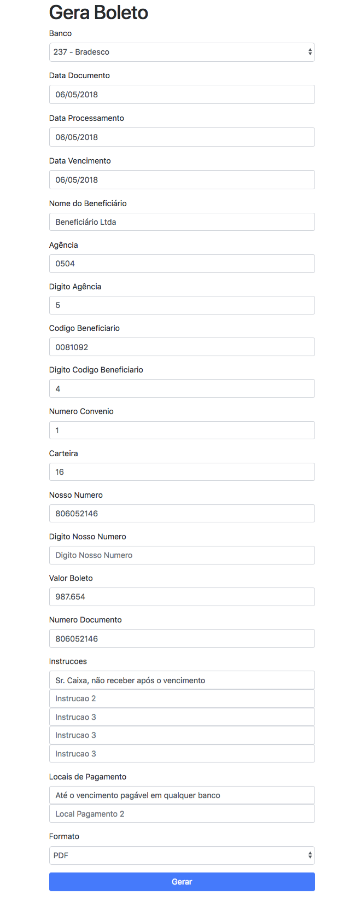

# Java-web-gera-boleto

REST API for PDF and PNG boleto generation.

Supported banks by [Stella Caelum](http://stella.caelum.com.br):
* 001 - Banco do Brasil
* 237 - Bradesco
* 104 - Caixa
* 399 - HSBC
* 341 - Itaú
* 033 - Santander

# Run

```
mvn spring-boot:run
```

# Browser

localhost:8080




# Using terminal

```
curl "http://localhost:8080/geraboleto" \
-H "Content-Type: application/x-www-form-urlencoded; charset=utf-8" \
-d numeroDoBanco=237 \
-d dataDocumento=2018-06-05 \
-d dataProcessamento=2018-06-05 \
-d dataVencimento=2018-06-05 \
-d nomeBeneficiario="Beneficiário Ltda" \
-d agencia=0504 \
-d digitoAgencia=5 \
-d codigoBeneficiario=0081092 \
-d digitoCodigoBeneficiario=4 \
-d numeroConvenio=5 \
-d carteira=16 \
-d nossoNumero=806052146 \
-d digitoNossoNumero=3 \
-d valorBoleto=987.654 \
-d numeroDoDocumento=77 \
-d instrucao1="Sr. Caixa, não receber após o vencimento" \
-d instrucao2="Instrução 2" \
-d instrucao3="Instrução 3" \
-d instrucao4="Instrução 4" \
-d instrucao5="Instrução 5" \
-d localDePagamento1="Até o vencimento pagável em qualquer banco" \
-d localDePagamento2="Local De Pagamento 2" \
-d pagadorNome="John Lenon" \
-d pagadorDocumento="123456789" \
-d formatoSaida=pdf > boleto.pdf
```
